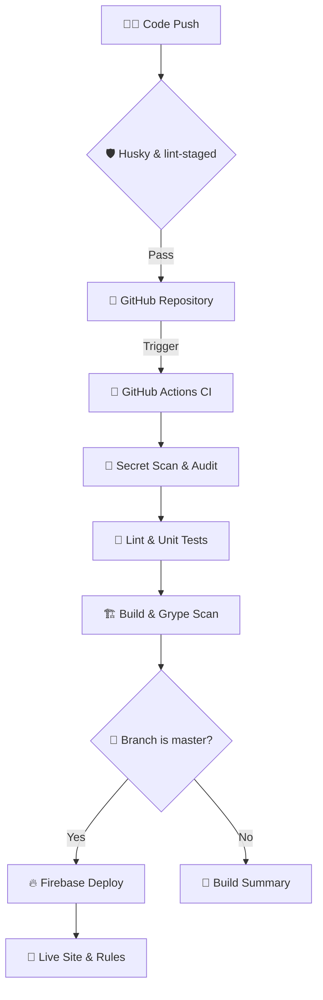

# ♾️ DevOps Lifecycle - One Way Out

This project follows modern DevOps practices to ensure high quality, secure, and rapid software delivery using strictly **open-source** tools.

## 🛠️ CI/CD Pipeline (`GitHub Actions`)
Located at `.github/workflows/firebase-deploy.yml`:

- **Universal Build & Test**: Every push to any branch triggers the following checks:
  -   `npm ci`: Strict dependency installation.
  -   `ESLint`: Static analysis for code quality.
  -   `Vitest`: Unit test suite execution.
  -   `Build`: Ensures the production React bundle succeeds.

- **Deployment**:
  -   **Continuous Deployment (CD)**: Exclusive to the `master` branch.
  -   **Firebase Hosting**: Automated deployment of the frontend.
  -   **Firestore Rules & Indexes**: Automated deployment of database security rules and performance indexes.

## 🛡️ Security First
The core of our pipeline is automated security scanning:

- **Gitleaks**: Scans every commit for accidental secrets (API keys, credentials) before they reach the repository.
- **npm audit**: Fails the build for any high-severity dependency vulnerabilities.
- **Anchore Grype**: Scans the filesystem and dependencies for deep-seated security vulnerabilities (CVEs).
- **Husky & lint-staged**: Local pre-commit hooks ensure that all code is linted and relevant tests pass before code even leaves the developer's machine.

## 🏗️ Infrastructure & Scalability
- **Firebase**: Managed serverless architecture for database (Firestore), authentication (Auth), and hosting.
- **Dockerfile**: A standardized build environment that guarantees a reproducible build process across any machine.
- **Dependabot**: Automated weekly dependency checks to keep our libraries up to date with the latest security patches.

## 📊 Observability
- **Custom Error Hook**: Located in `src/hooks/useErrorTracking.js`. Standardizes how errors are captured, including context (URL, device, timestamp).
- **GitHub Environments**: Used to track deployment history and manage secrets/variables.

---
*Built with passion for stability and speed.*
